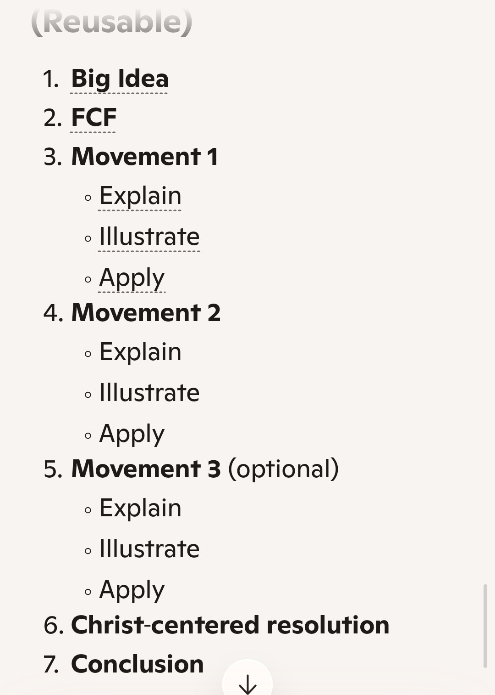

<!-- ================================================================comment -->

## l'exposition

:::::: columns
::: {.column width="35%"}
{width="100"}
:::

::: {.column width="8%"}
:::

::: {.column .smaller width="55%"}
{width="300"}
:::
::::::

::: notes
speaker note
:::

<!-- ================================================================comment -->

## Big Idea

:::::: columns
::: {.column width="35%"}
{width="100"}
:::

::: {.column width="8%"}
:::

::: {.column .smaller width="55%"}
```{=html}
<!-- BUTTON 1 WRAPPER -->
    <button class="callout-trigger">Subject</button>
    +
    <button class="callout-trigger">Complement</button>
    =
    <button class="callout-trigger alt">Big Idea</button>
```

Explain how the psalm moves from memory of God’s past deliverance to
present suffering to a plea for God’s intervention.
:::
::::::

::: notes
speaker note
:::

<!-- ================================================================comment -->

## Fallen Condition Focus

:::::: columns
::: {.column width="35%"}
{width="250"}
:::

::: {.column width="8%"}
:::

::: {.column .smaller width="55%"}
The fallen condition focus is the specific human problem (weakness, sin,
fear or need) in a biblical passage that reveals why people require
God's grace.
:::
::::::

::: notes
speaker note
:::


<!-- ================================================================comment -->

## Mouvement 1 

:::::: columns
::: {.column width="35%"}
{width="250"}

1. Explain
2. Illustrate
3. Apply
:::

::: {.column width="8%"}
:::

::: {.column .smaller width="55%"}
1. la vraie prière

- s'adresse au seul Dieu vivant
- et bien informée
- elle dit: "Je ..."
- ... fais appel à Toi

2. je tends mes mains vers Toi, mon âme a soif du Dieu vivant

3. du fond de la détresse, jour et nuit
:::
::::::

::: notes
speaker note
:::