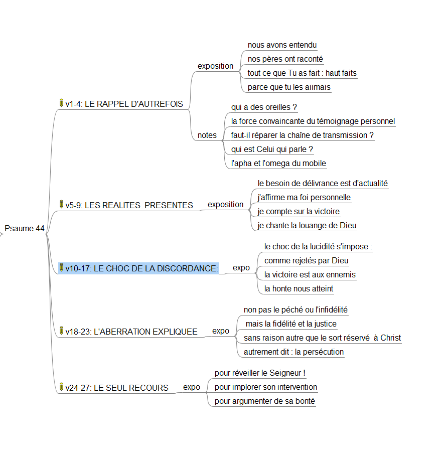

<!-- ================================================================comment -->

## Part 1

:::::: columns
::: {.column width="35%"}
{width="150"}
:::

::: {.column width="8%"}
:::

::: {.column .smaller width="55%"}
```{mermaid}
flowchart TD
   A(RAPPEL D'AUTREFOIS) --> C(CHOC DE LA DISCORDANCE)
   B(URGENCE PRESENTE) --> C
   C --> D(L'ABERRATION EXPLIQUEE)
   C --> E(LE SEUL RECOURS)
```
:::
::::::

<!-- ================================================================comment -->

## TOC

:::::: columns
::: {.column width="35%"}
:::

::: {.column width="8%"}
:::

::: {.column .smaller width="55%"}

:::
::::::

<!-- A1================================================================comment -->

## Difficile repérage

:::::: columns
::: {.column width="35%"}
**Coeur**
:::

::: {.column width="8%"}
:::

::: {.column .smaller width="55%"}
*44 Au chef de chœur. Des descendants de Koré, cantique.*

<br><br>

*2 O Dieu, ...*
:::
::::::

<!-- A2================================================================comment -->

## Nous avons entendu ...

:::::: columns
::: {.column width="35%"}
<br>

- qui a des oreilles ?

- où sont les pères ?

- où vont les conversations ?
:::

::: {.column width="8%"}
:::

::: {.column .smaller width="55%"}
<br> *... nous avons entendu de nos oreilles, nos pères nous ont raconté
tout ce que tu as accompli à leur époque, par le passé.*

<br> *3 De ta main tu as chassé des nations pour qu’ils puissent
s’établir, tu as frappé des peuples pour qu’ils puissent s’étendre*
:::
::::::

<!-- A3================================================================comment -->

## pourquoi ?

:::::: columns
::: {.column width="35%"}
### Left Column (1/3)

- Key point one
:::

::: {.column width="8%"}
:::

::: {.column .smaller width="55%"}
*4 En effet, ce n’est pas par leur épée qu’ils se sont emparés du pays,
ce n’est pas leur bras qui les a sauvés,*

<br> *mais c’est ta main droite, c’est ton bras, c’est la lumière de ton
visage, parce que tu les aimais.*
:::
::::::

<!-- B1================================================================comment -->

## je crois pareillement

:::::: columns
::: {.column width="35%"}
:::

::: {.column width="8%"}
:::

::: {.column .smaller width="55%"}
*5 O Dieu, tu es mon roi:*

<br> *ordonne la délivrance de Jacob!*
:::
::::::

<!-- B2================================================================comment -->

## je crois pareillement

:::::: columns
::: {.column width="35%"}
:::

::: {.column width="8%"}
:::

::: {.column .smaller width="55%"}
*6 Grâce à toi nous renversons nos ennemis, grâce à ton nom nous
écrasons nos adversaires,*

<br> *7 car ce n’est pas en mon arc que je me confie, ce n’est pas mon
épée qui me sauvera,*

<br> *8 mais c’est toi qui nous délivres de nos ennemiset qui fais
rougir de honte ceux qui nous détestent.*
:::
::::::

<!-- B3================================================================comment -->

## je crois pareillement

:::::: columns
::: {.column width="35%"}
:::

::: {.column width="8%"}
:::

::: {.column .smaller width="55%"}
*9 Nous chantons la louange de Dieu chaque jour,*

<br> *et nous célébrerons éternellement ton nom.*
:::
::::::

<!-- C1===============================================================comment -->

## pourquoi1 ?

:::::: columns
::: {.column width="35%"}
:::

::: {.column width="8%"}
:::

::: {.column .smaller width="55%"}
*– Pause.*

<br> *10 Cependant tu nous as repoussés, tu nous as couverts de honte,tu
ne sors plus avec nos armées.*

<br> *11 Tu nous fais reculer devant l’ennemi, et ceux qui nous
détestent se partagent nos dépouilles.*
:::
::::::

<!-- C2================================================================comment -->

## pourquoi1 ?

:::::: columns
::: {.column width="35%"}
:::

::: {.column width="8%"}
:::

::: {.column .smaller width="55%"}
*12 Tu nous livres comme des brebis de boucherie,tu nous disperses parmi
les nations.*

<br> *13 Tu vends ton peuple pour rien, tu ne l’estimes pas à une grande
valeur.*
:::
::::::

<!-- C3================================================================comment -->

## pourquoi 2?

:::::: columns
::: {.column width="35%"}
:::

::: {.column width="8%"}
:::

::: {.column .smaller width="55%"}
*14 Tu nous exposes aux insultes de nos voisins, à la moquerie et aux
railleries de ceux qui nous entourent.*

<br> *15 Tu fais de nous le sujet d’un proverbe parmi les nations, on
hoche la tête sur nous parmi les peuples.*
:::
::::::

<!-- D1================================================================comment -->

## pourquoi 2?

:::::: columns
::: {.column width="35%"}
:::

::: {.column width="8%"}
:::

::: {.column .smaller width="55%"}
*16 Mon humiliation est toujours devant moi, et la honte couvre mon
visage*

<br> *17 à la voix de celui qui m’insulte et me déshonore, à la vue de
l’ennemi avide de vengeance.*
:::
::::::

<!-- D2================================================================comment -->

## une injustice

:::::: columns
::: {.column width="35%"}
:::

::: {.column width="8%"}
:::

::: {.column .smaller width="55%"}
*18 Tout cela nous arrive alors que nous ne t’avons pas oublié et que
nous n’avons pas violé ton alliance.*

<br> *19 Nous n’avons pas fait marche arrière dans notre cœur, nous ne
nous sommes pas écartés de ton sentier.*

<br> *20 Pourtant, tu nous as écrasés dans le territoire des chacalset
tu nous as couverts de l’ombre de la mort.*
:::
::::::

<!-- D3================================================================comment -->

## la cause

:::::: columns
::: {.column width="35%"}
:::

::: {.column width="8%"}
:::

::: {.column .smaller width="55%"}
*21 Si nous avions oublié le nom de notre Dieu et tendu nos mains vers
un dieu étranger,*

*22 Dieu ne le saurait-il pas, lui qui connaît les secrets du cœur?*

<br> *23 Mais c’est à cause de toi qu’on nous met à mort à longueur de
journée, qu’on nous considère comme des brebis destinées à la
boucherie.*
:::
::::::

<!-- E1================================================================comment -->

## l'ultime pétition

:::::: columns
::: {.column width="35%"}
:::

::: {.column width="8%"}
:::

::: {.column .smaller width="55%"}
*24 Lève-toi* *Pourquoi dors-tu, Seigneur?*

*Réveille-toi, ne nous repousse pas pour toujours!*

*25 Pourquoi te caches-tu?*

*Pourquoi oublies-tu notre misère et notre oppression*

*26 quand nous sommes affalés dans la poussière,quand nous rampons par
terre?*
:::
::::::

<!-- E2================================================================comment -->

## l'ultime pétition

:::::: columns
::: {.column width="35%"}
:::

::: {.column width="8%"}
:::

::: {.column .smaller width="55%"}
*27 Lève-toi pour nous secourir,*

<br> *délivre-nous à cause de ta bonté!*
:::
::::::
