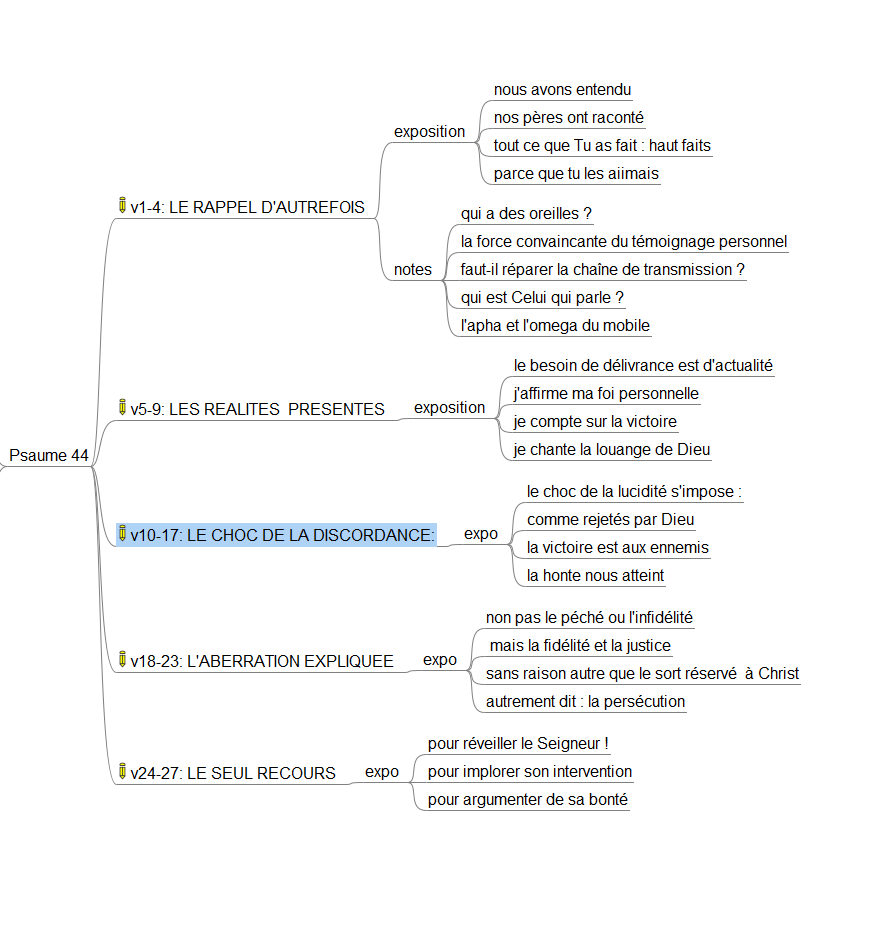

## lecture et progression
:::::: columns
::: {.column width="35%"}
<ol type="A">
  <li>v1-4</li>
  <li>v5-9</li>
  <li>v10-17</li>
  <li>v18-23</li>
  <li>v24-27</li>
</ol>

:::

::: {.column width="8%"}
:::
::: {.column .smaller width="55%"}
```{mermaid}
flowchart TD
   AA["<div title="1-4">AUTREFOIS, les miracles (A)</div>"]  --> BB["<div title="5-9">A PRESENT, l'urgence (B)</div>"] 
   BB --> CC["<div title="9-17">LA DEFAITE, inexplicable (C)</div>"]
   CC --> DD["<div title="18-23">EXPLICATIONS, divines (D)</div>"]
   DD --> EE["<div title="24-27">LA PETITION, en fin (E)</div>"]
```
:::
::::::
::: notes
:::


<!-- ================================================================comment -->

## la défaite du chrétien priant

:::::: columns
::: {.column width="35%"}
{width="250"}
{width="300"}
:::

::: {.column width="8%"}
:::

::: {.column .smaller width="55%"}
(le problème humain) 

1.  **de la fidélité divine** dans l'histoire passée, j'attends, dans
    l'épreuve actuelle, **une pareille délivrance** 
    
2. cependant **la défaite honteuse** supplante le triomphe escompté, sans être le
    fruit du péché,


:::
::::::

::: notes
FCF: lorsqu'à notre prière sincère, Dieu répond négativement, notre grand désarroi va-t-il éteindre notre prière et notre foi?
:::


<!-- ================================================================comment -->

## la grande idée

:::::: columns
::: {.column width="28%"}


après la pause, les explications divines

:::

::: {.column width="8%"}
:::

::: {.column .smaller width="62%"}
<!-- {width="250"} -->

le passage du souvenir des délivrances passées et de la situation présente de détresse au plaidoyer audacieux pour le secours de Dieu s'explique

- par la souveraineté de Dieu qui nous **associe à Christ** jusqu'à l'ignominie 
- par l'argument de **Sa propre bonté** qui perdure pour nous secourir encore

:::
::::::

::: notes

Explain how the psalm moves from memory of God’s past deliverance to present suffering to a plea for God’s intervention.

:::

<!-- ================================================================comment -->

## le Psaume 44

:::::: columns
::: {.column width="35%"}
{width="125"}

Pour les fils de Koré

<ol type="1">
  <li>PS 42 à 49</li>
  <li>PS 84 à 89</li>
</ol>


:::

::: {.column width="8%"}
:::

::: {.column .smaller width="55%"}
*44 Au chef de chœur. Des descendants de Koré, cantique.*

<br><br>
_Un **maskil** est un psaume didactique, c’est‑à‑dire un chant conçu pour instruire, enseigner._
:::
::::::

::: notes
:::


<!-- ================================================================comment -->
## généalogie de Lévi et Koré
:::::: columns
::: {.column width="25%"}
- Moïse et Koré, cousins au service de Dieu
- comme Jean-Baptiste et Jésus ?
:::

::: {.column width="5%"}
:::

::: {.column .smaller width="69%"}
```{mermaid}
flowchart TD
   A["<div title='3e fils de Jacob-Israêl, tribu mise à part pour le service du sanctuaire, sans territoire si ce n est 48 villes dont 6 de refuge'><b>LEVI</b></div>"] --> B(Guershom)
   A --> C(**KEHATH**)
   A --> D(Merari)

   %% --- Sous-graph Kehath ---
      C --> E(Amram)
      C --> F(Jitsehar)
      C --> G(Hébron)
      C --> H(Uziel)

      E --> I(Aaron)
      E --> J["<div title="9-17" style="color: red">MOISE</div>"]
      E --> K(Myriam)

      F --> N["<div title="9-17" style="color: red">KORE&dagger;</div>"]
      N --> O(Assir)
      N --> P(Elkana)
      N --> Q(Abiasaph)

      P --> R["<div style="color: red">? ? ?</div>"]

   %% --- Sous-graph Merari ---
%%      D --> L(Machli)
%%      D --> M(Muschi)
```

:::
::::::
::: notes
:::

<!-- ================================================================comment -->
## descendants de Koré
:::::: columns
::: {.column .smaller width="25%"}
<span style="font-size: 1.6rem;">
« Les fils de Koré ne moururent point. »  Nombres 26:11 car Dieu ne punit pas les enfants pour la faute de leurs parents.
</span>
:::

::: {.column width="5%"}
:::

::: {.column .smaller width="69%"}
Ils ne sont ni des gens d'armes, ni fonctionnaires, ni mercenaires 
mais des **portiers-gardiens** du temple et de ses trésors, des **chantres**, 
des hommes du Dieu de leur vie, guidés par la fidélité à leur Seigneur, habités du souvenir des oeuvres de l'Eternel, 
des hommes de coeur, émotionnels, des artistes maniant la harpe, la flûte, le chant et la poésie. 
:::
::::::
::: notes
ce sont des serviteurs épris de vérité et de justice, sensibles à la soif spirituelle, interrogés par les paradoxes, insultés par leurs contemporains irreligieux, mais concernés par le sort désastreux échu à leur peuple, 
un groupe solidaire d'hommes de prière relevant le défi de l'intercession pour une cause apparement perdue, soucieux de transmettre à la génération suivante la véritable connaissance de Dieu, et qui s'accrochent à conserver toujours l' espérance du salut parce qu'ils ont reconnu l'amour indéfectible de Dieu pour son peuple.
4. descendant de Koré 
du temps de Moise, de Samuel/David, de Josaphat, d Ezechias, de retour d exil a Babylone

1. Moïse (L'Exode) :  autour de 1250 av. J.-C. au temps du règne du pharaon Ramsès II.
​2. Le roi David : ~1010 à 970 av. J.-C.
​3. Le roi Josaphat : ~873 à 849 av. J.-C.
​4. Le roi Ézéchias : ~716 à 687 av. J.-C. célèbre pour ses réformes religieuses et pour avoir résiste au siège du roi assyrien Sennachérib en 701 av. J.-C.
​5. Le retour d'exil : ~538 av. J.-C. par l edit du roi Cyrus
:::

<!-- ================================================================comment -->
## une lignée exemplaire
:::::: columns
::: {.column width="8%"}
:::

::: {.column width="5%"}
:::

::: {.column .smaller width="86%"}
Ils incarnent les serviteurs épris de vérité et de justice, sensibles à la soif spirituelle, interrogés par les paradoxes, insultés par leurs contemporains irreligieux, mais concernés par le sort désastreux échu à leur peuple, 
Ils forment un groupe solidaire d'hommes de prière relevant le défi de l'intercession pour une cause apparement perdue, soucieux de transmettre à la génération suivante la véritable connaissance de Dieu, et qui s'accrochent à conserver toujours l'espérance du salut parce qu'ils ont reconnu l'amour indéfectible de Dieu pour son peuple.
:::
::::::
::: notes

:::

<!-- ================================================================comment -->
## A travers les siècles

```{r}
library(highcharter)
library(dplyr)
library(tibble)

timeline_israel <- tibble::tribble(
  ~name,                         ~label,                      ~description,                                           ~x,
  "<span style='background-color: lightgreen;'>Séjour en Égypte, Exode</span>",       "1600–1200 av. J.-C.", " <b>MOÏSE, Koré</b> et Israêl sortent d'Égypte",               -1400,
  "<span style='background-color: lightgreen;'>Monarchie unifiée</span>",              "1020–930 av. J.-C.",        " <b>SAMUEL et DAVID</b> instaurent les 24 classes du service lévitique",                       -975,
  "<span style='background-color: lightgreen;'>Monarchie divisée</span>",              "930–586 av. J.-C.",         " <b>JOSAPHAT & EZECHIAS</b> réformateurs; Élie; Isaïe; Jérémie",                -758,
  "Exil à Babylone",                "586–538 av. J.-C.",         "Destruction du Temple; Ézéchiel; Daniel",            -562,
  "<span style='background-color: lightgreen;'>Retour d'exil & période perse</span>",  "538–332 av. J.-C.",         "CYRUS; reconstruction du Temple; Esdras;  <b>NEHEMIE</b>",   -435,
  "Période hellénistique",          "332–164 av. J.-C.",         "Alexandre; Séleucides; tensions religieuses",        -248,
  "Période hasmonéenne",            "164–63 av. J.-C.",          " <b>MACCABEES</b>; indépendance; Hasmonéens",                -113.5,
  "<span style='background-color: lightgreen;'>Période romaine</span>",                "63 av. J.-C.–70 ap. J.-C.", "Pompée; Hérode; naissance et ministère de <b>JESUS</b>",     3.5,
  "Eglise Primitive",                "70 -313 ap. J.-C.", "Pères de l'Eglise",     190
)

# 2. Build the Highcharter Timeline
highchart() %>%
  hc_chart(type = "timeline") %>%
  hc_title(text = "Présence des descendants de Koré") %>%
  hc_subtitle(text = "figures fidèles du peuple de Dieu !") %>%
  hc_add_series(
    data = timeline_israel,
    type = "timeline",
    hcaes(x = x, name = name, label = label, description = description),
    dataLabels = list(
      useHTML = TRUE,
      allowOverlap = FALSE,
      format = '<b>{point.name}</b><br>{point.label}'
    )
  ) %>%
  hc_tooltip(
    useHTML = TRUE,
    headerFormat = "",
    pointFormat = '<b>({point.x})</b><br>{point.description}'
  ) %>%
  hc_xAxis(
    type = "linear"
##    title = list(text = "Year (Negative = BCE, Positive = CE)")
  )

```

::: notes
du temps de Moise, de Samuel/David, de Josaphat, d Ezechias, de retour d exil a Babylone

1. Moïse (L'Exode) :  autour de 1250 av. J.-C. au temps du règne du pharaon Ramsès II.
​2. Le roi David : ~1010 à 970 av. J.-C.
​3. Le roi Josaphat : ~873 à 849 av. J.-C.
​4. Le roi Ézéchias : ~716 à 687 av. J.-C. célèbre pour ses réformes religieuses et pour avoir résiste au siège du roi assyrien Sennachérib en 701 av. J.-C.
​5. Le retour d'exil : ~538 av. J.-C. par l edit du roi Cyrus
:::


<!-- A :4================================================================comment -->
## AUTREFOIS, les miracles
:::::: columns
::: {.column width="35%"}
### Section A

Ps44:1-4
:::

::: {.column width="8%"}
:::
::: {.column .smaller width="55%"}
:::
::::::
::: notes
:::

<!-- ================================================================comment -->

## type-1: la prière d'apprentissage

:::::: columns
::: {.column width="40%"}

{fig-align="left"
width="175"}

:::

::: {.column width="3%"}
:::

::: {.column .smaller width="57%"}
<br> *2 **O Dieu<sup>a</sup>**, ... nous avons entendu de **nos oreilles<sup>b</sup>**, **nos pères<sup>c</sup>** nous ont raconté
tout ce que **tu as accompli<sup>d</sup>** à leur époque, par le passé.*

<br>
_la vraie prière s'adresse au **seul Dieu vivant**_

:::
::::::

::: notes

- à des oreilles pour entendre le témoignage des pères
- et des yeux pour voir la main de Dieu dans l'histoire

- calibrons notre compréhension avec les histoires de la Bible et créons les occasions de témoignage pour raconter ce que Dieu a fait pour nous.

- histoire que Dieu a écrite: Paque / Cene / Réforme, réveils;

2. mon âme a soif du Dieu vivant, je tends mes mains vers Toi, du fond de la détresse, jour et nuit
:::

<!-- A2================================================================comment -->

## b: Nous avons entendu ...

:::::: columns
::: {.column width="35%"}
{fig-align="left"
width="120"}

<div style="font-size: 1.6rem;">
_Alors il leur ouvrit l’intelligence, afin qu’ils comprennent les Écritures._

<ol>
<li>le petit Samuel</li>
<li>la veuve de Sarepta</li>
<li>les douze disciples</li>
<li>l'eunuque éthiopien</li>
<li>la marchande Lydie</li>
</ol>
</div>
:::

::: {.column width="8%"}
:::

::: {.column .smaller width="55%"}
les descendants de Koré possédaient mieux que les statues, cette capacité d'entendre par les oreilles en concentrant leur attention sur un langage spirituel nouveau, une voix jusque là inconnue, mais dont le sens parfaitement intelligible s'impose à leur esprit jusqu'à dire **"maintenant, je comprends"**
:::
::::::

<!-- ================================================================comment -->

## c: où sont les pères ?

:::::: columns
::: {.column width="30%"}
- créons des conversations spirituelles
- racontons les miracles de notre temps
- avec la persuasion du témoignage personnel

:::


::: {.column width="8%"}
:::

::: {.column .smaller width="60%"}
_« Comment croiront‑ils en celui dont ils n’ont pas entendu parler ? Et comment entendront‑ils parler, **si personne ne l’annonce** ? »_ Rom10:14

<br>
«Nous **ne le cacherons point** à leurs enfants; nous raconterons **à la génération future les louanges de l’Éternel**, sa puissance et les merveilles qu’il a faites. » Ps78:4
:::
::::::

## d: les interventions passées

:::::: columns
::: {.column width="40%"}
<div style="font-size: 1.6rem;">
<ol>
<li>pour Israël, arraché à l'Egypte, transplanté comme une vigne en Canaan</li>
<li>pour l'Europe, libérée des indulgences par les réformateurs et de l'athéisme désséchant par les _revivalistes_</li>
<li>où sont pour nous, les miracles d'antan, d'aujourd'hui et de demain?</li>
<li>raconte les!</li>
</ol>
</div>
:::

::: {.column width="8%"}
:::

::: {.column .smaller width="50%"}
*3 De ta main tu as **chassé** des nations pour qu’ils puissent
s’établir, tu as frappé des peuples pour qu’ils puissent **s’étendre** *

<span style="font-size: 1.6rem;">
Personne ne peut entrer dans la maison de l’homme fort et piller ses biens, sans avoir auparavant lié cet homme fort. Marc3:27 nous parle de Jésus qui a vaincu Satan, le dominateur de notre coeur.
</span>
:::

::: notes
libéré de la vie insoutenable en Egypte, transplanté comme une vigne du meilleur cépage au pays promis à Abraham,   / coeur nouveau P:histoire que Dieu a écrite: Paque / Cene / Réforme, réveils, aujourd'hui
:::
::::::

<!-- ================================================================comment -->

## e: par quelle puissance ?

:::::: columns
::: {.column width="35%"}
#### nous savons
<div style="font-size: 1.6rem;">

Le **salut** est le fruit
<ol>
<li>non pas de nos efforts</li>
<li>mais de La faveur imméritée</li>
<li>de Jésus qui pardonne les péchés</li>
</ol></div>
:::

::: {.column width="8%"}
:::

::: {.column .smaller width="55%"}
*4 En effet, ce n’est pas par leur épée qu’ils se sont emparés du pays,
ce n’est **pas leur bras<sup>5</sup>** qui les a sauvés,*

*mais c’est ta main droite, c’est ton bras, c’est la lumière de ton
visage, **parce que tu les aimais<sup>6</sup>**.*

<span style="font-size: 1.6rem;">
La bonté de Dieu demeure la 'cause première' qui ne dépend d'aucune autre: la seule explication de tout ce qui nous arrive, dans le respect de son indiscutable souveraineté.
</span>
:::
::::::


<!-- B :9================================================================comment -->
## A PRESENT, l'urgence
:::::: columns
::: {.column width="35%"}
### Section B

Ps44:5-9
:::

::: {.column width="8%"}
:::
::: {.column .smaller width="55%"}
:::
::::::
::: notes
:::

<!-- ================================================================comment -->

## type-2: la prière d'application

:::::: columns
::: {.column width="47%"}
{fig-align="left" width="200"}
<h4>la vraie prière</h4>
<div style="font-size: 1.6rem;">
<ol>
<li>s'adresse au Souverain</li>
<li>devient personnelle</li>
<li>détecte la détresse</li>
<li>appelle à l'aide</li>
</ol></div>
:::

::: {.column width="2%"}
:::

::: {.column .smaller width="47%"}
<br>
*5 O **Dieu**<sup>1</sup>, tu es **mon roi**<sup>2</sup>:*

<br> *ordonne **la délivrance**<sup>3</sup> de Jacob!*
:::
::::::

::: notes
délivré de la vie insoutenable en Egypte, transplanté comme une vigne du meilleur cépage au pays promis à Abraham,   / coeur nouveau P:histoire que Dieu a écrite: Paque / Cene / Réforme, réveils, aujourd'hui
:::

<!-- ================================================================comment -->

## que vois-tu ?

:::::: columns
::: {.column width="35%"}
<div style="font-size: 1.6rem;">
Fuyant devant Absalom, son fils David s"écrie:

_« Éternel, que mes ennemis sont **nombreux !**  Beaucoup se lèvent contre moi. »_ Ps3:2
</div>
:::

::: {.column width="8%"}
:::

::: {.column .smaller width="55%"}
#### Jérémie, Amos, ...

```{ojs}
// --- 1. REDRAW BUTTON & DATA GENERATOR ---

data = {
  redraw; // Reactive dependency: re-runs when button is clicked

  const labels = ['Guerre', 'Maladie', 'Finances', 'Relations', 'Moi', 'Persécution', 'Catastrophes', 'Cqrd', 'Spirituel'];

  const metadata = {
    'Guerre': { desc: 'Impact des conflits et guerres', url: 'https://example.com/guerre' },
    'Maladie': { desc: 'Sujets liés à la santé et aux maladies'},
    'Finances': { desc: 'Gestion financière et épreuves économiques'},
    'Relations': { desc: 'Défis relationnels et sociaux'},
    'Moi': { desc: 'Développement personnel et état d\'esprit' },
    'Persécution': { desc: 'Expériences de discrimination ou de persécution'},
    'Catastrophes': { desc: 'Impact des événements naturels ou accidents'},
    'Cqrd': { desc: 'Ce Qui Reste Pour Dieu' },
    'Spirituel': { desc: 'Vie et Batailles dans sphères invisibles'}
  };

const minRatio = 0.10; // 5% minimum floor per item
  const count = labels.length;
  const remainingBudget = 1 - (minRatio); // Remaining weight to distribute (55% for 9 items)

  // 1. Generate random weights
  const rawData = labels.map(label => ({
    label,
    random: minRatio + remainingBudget*Math.random()
  }));

  const totalRandom = rawData.reduce((acc, d) => acc + d.random, 0);

  return {
    name: "root",
    children: [
      {
        name: "Categories",
        children: rawData.map(d => ({
          name: d.label,
          value: d.random ,
          desc: metadata[d.label].desc,
          url: metadata[d.label].url
        }))
      }
    ]
  };
}

// --- 2. CONFIGURATION ---
width = 800

height = 500

fontSize = "24px"

// --- 3. HIERARCHY CALCULATION ---
root = {
  const h = d3.hierarchy(data)
      .sum(d => d.value)
      .sort((a, b) => b.value - a.value);
  
  return d3.treemap()
      .size([width, height])
      .paddingInner(2)
      (h);
}

// --- 4. TOOLTIP ELEMENT ---
tooltip = d3.select("body").append("div")
    .style("position", "absolute")
    .style("visibility", "hidden")
    .style("background", "rgba(0, 0, 0, 0.85)")
    .style("color", "#fff")
    .style("padding", "8px 12px")
    .style("border-radius", "4px")
    .style("font-size", "12px")
    .style("pointer-events", "none")
    .style("z-index", "1000")
    .style("font-family", "sans-serif")

// --- 5. CHART RENDERING ---
chart = {
  const svg = d3.create("svg")
      .attr("viewBox", [0, 0, width, height])
      .attr("width", "100%")
      .attr("height", "auto")
      .style("font", "12px sans-serif");

  const leaf = svg.selectAll("g")
    .data(root.leaves())
    .join("g")
    .attr("transform", d => `translate(${d.x0},${d.y0})`);

  const link = leaf.append("a")
    .attr("xlink:href", d => d.data.url)
    .attr("target", "_blank")
    .style("cursor", "pointer");

  link.append("rect")
    .attr("fill", (d, i) => d3.schemeTableau10[i % 10])
    .attr("fill-opacity", 0.7)
    .attr("width", d => d.x1 - d.x0)
    .attr("height", d => d.y1 - d.y0)
    .attr("stroke", "white")
    .on("mouseover", function(event, d) {
      d3.select(this).attr("fill-opacity", 1);
      tooltip.style("visibility", "visible")
             .html(`<span style="font-size: 2rem;">${d.data.desc}<br/></span>`);
    })
    .on("mousemove", function(event) {
      tooltip.style("top", (event.pageY - 10) + "px")
             .style("left", (event.pageX + 10) + "px");
    })
    .on("mouseout", function() {
      d3.select(this).attr("fill-opacity", 0.7);
      tooltip.style("visibility", "hidden");
    });

  link.append("text")
    .attr("x", d => (d.x1 - d.x0) / 2)
    .attr("y", d => (d.y1 - d.y0) / 2)
    .attr("dy", "0.35em")
    .attr("text-anchor", "middle")
    .attr("fill", "white")
    .attr("fill", "black") // <--- CHANGED FONT COLOR TO BLACK
    .style("font-size", fontSize)
    .style("font-weight", "bold")
    .style("pointer-events", "none")
    .text(d => (d.x1 - d.x0 > 50 && d.y1 - d.y0 > 25) ? d.data.name : "");

  return svg.node();
}
viewof redraw = Inputs.button("Anew")

```

<span style="font-size: 1.6rem;">
une marmite bouillonante, une branche d'amandier, un fil à plomb, un panier de figues
</span>
:::
::::::

::: notes
:::

<!-- B2================================================================comment -->

## le recours à la foi

:::::: columns
::: {.column width="40%"}
{fig-align="left" width="200"}

<div style="font-size: 1.6rem;">
Respectant la logique

1. nous avons compris
2. nous croyons
3. nous expérimentons

car ce que Dieu a fait autrefois, Il peut le refaire aujourd'hui, puisqu'Il ne change pas.

<br>CQFD
</div>

:::

::: {.column width="5%"}
:::

::: {.column .smaller width="55%"}
*6 **Grâce à toi<sup>4</sup>** nous renversons nos ennemis, grâce à ton nom nous
écrasons nos adversaires,*

<br> *7 car ce n’est pas en mon arc que je me confie, ce n’est **pas mon
épée<sup>5</sup>** qui me sauvera,*

<br> *8 mais c’est toi qui nous délivres de nos ennemis et qui fais
rougir de honte ceux qui nous détestent.*
:::
::::::

<!-- B3================================================================comment -->

## avec certitude

:::::: columns
::: {.column width="35%"}
<br>
<div style="font-size: 1.6rem;">
- nous anticipons la victoire de Christ
- avant l'heure
</div>
:::

::: {.column width="8%"}
:::

::: {.column .smaller width="55%"}
*9 Nous chantons **la louange<sup>6</sup>** de Dieu chaque jour,*

<br> *et nous célébrerons éternellement ton nom.*
:::
::::::

<!-- C :17================================================================comment -->
## C:17
:::::: columns
::: {.column width="35%"}
:::

::: {.column width="8%"}
:::
::: {.column .smaller width="55%"}
:::
::::::
::: notes
:::

<!-- C1===============================================================comment -->

## Type-3: la prière déçue

:::::: columns
::: {.column width="35%"}
{width="150"}

l'ennemi redoutable qui te paralyse
:::

::: {.column width="8%"}
:::

::: {.column .smaller width="55%"}
**– PAUSE**

<br> *10 Cependant <u>tu</u> nous as repoussés, <u>tu</u> nous as couverts de honte, <u>tu</u>
ne sors plus avec nos armées.*

<br> *11 <u>tu</u> nous fais reculer devant l’ennemi, et ceux qui nous
détestent se partagent nos dépouilles.*
:::
::::::

<!-- C2================================================================comment -->

## ... vendus,

:::::: columns
::: {.column width="35%"}
{fig-align="left"  width="200"}
:::

::: {.column width="8%"}
:::

::: {.column .smaller width="55%"}
*12 <u>tu</u> nous livres comme des brebis de boucherie, <u>tu</u> nous disperses parmi
les nations.*

<br> *13 <u>tu</u> vends ton peuple pour rien, <u>tu</u> ne l’estimes pas à une grande
valeur.*
:::
::::::

<!-- C3================================================================comment -->

## l'agent de la défaite

:::::: columns
::: {.column width="37%"}
{width="175"}

la souveraineté incontestée de Dieu
:::

::: {.column width="6%"}
:::

::: {.column .smaller width="55%"}
*14 <u>tu</u> nous exposes aux insultes de nos voisins, à la moquerie et aux
railleries de ceux qui nous entourent.*

<br> *15 <u>tu</u> fais de nous le sujet d’un proverbe parmi les nations, on
hoche la tête sur nous parmi les peuples.*
:::
::::::

::: notes
:::

<!-- D1================================================================comment -->

## la honte ne m'épargne pas

:::::: columns
::: {.column width="35%"}
:::

::: {.column width="8%"}
:::

::: {.column .smaller width="55%"}
*16 Mon humiliation est toujours devant moi, et la honte couvre mon
visage*

<br> *17 à la voix de celui qui m’insulte et me déshonore, à la vue de
l’ennemi avide de vengeance.*
:::
::::::

<!-- D :23================================================================comment -->
## D:23
:::::: columns
::: {.column width="35%"}
:::

::: {.column width="8%"}
:::
::: {.column .smaller width="55%"}
:::
::::::
::: notes
:::

<!-- D2================================================================comment -->

## Type-4: la prière d'objection

:::::: columns
::: {.column width="35%"}
{width="175"}

la cause du péché et de l'infidélité est écartée

:::

::: {.column width="8%"}
:::

::: {.column .smaller width="55%"}
*18 Tout cela nous arrive alors que nous ne t’avons pas oublié et que
nous n’avons pas violé ton alliance.*

*19 Nous n’avons pas fait marche arrière dans notre cœur, nous ne nous
sommes pas écartés de ton sentier.*

*20 Pourtant, tu nous as écrasés dans le territoire des chacals et tu
nous as couverts de l’ombre de la mort.*
:::
::::::

<!-- D3================================================================comment -->

## la clarification de Dieu

:::::: columns
::: {.column width="35%"}
:::

::: {.column width="8%"}
:::

::: {.column .smaller width="55%"}
*21 Si nous avions oublié le nom de notre Dieu et tendu nos mains vers
un dieu étranger,*

*22 Dieu ne le saurait-il pas, lui qui connaît les secrets du cœur?*

<br> *23 Mais c’est à cause de toi qu’on nous met à mort à longueur de
journée, qu’on nous considère comme des brebis destinées à la
boucherie.*
:::
::::::

<!-- ================================================================comment -->
## faisons le point

:::::: columns
::: {.column width="35%"}
_« Que nul de vous ne souffre comme meurtrier, voleur, ou malfaiteur
mais si quelqu’un souffre comme chrétien, qu’il n’en ait pas honte »_  1Pi4:15 
:::

::: {.column width="8%"}
:::
::: {.column .smaller width="55%"}
1. l'Eternel nous conduit à la victoire mais nos faits d'armes n'y sont pour rien, même quand ils y participent.
2. l'Eternel conduit le justifié par la défaite mais ses échecs n'y contribuent pas.
3. être défait pour la cause de Christ n'a rien à voir avec nos faillites, si ce n'est de donner un argument à l'accusateur
:::
::::::
::: notes
:::

<!-- ================================================================comment -->
## associé es qualité de Christ
:::::: columns
::: {.column .smaller width="29%"}
{width="150"}

la cause première

<span style="font-size: 1.6rem;">
Autrement dit un associé
<ol>
<li>qui agit ou existe dans la qualité que Christ lui confère</li>  
<li>par union avec Christ</li>
<li>dans la position ou le statut que Christ donne</li>
</ol></span>

CQFD

:::

::: {.column width="6%"}
:::
::: {.column .smaller width="63%"}
<span style="font-size: 1.6rem;">
35 Qui nous séparera de l'amour de Christ? Serait-ce la détresse, l'angoisse, la persécution, la faim, le dénuement, le danger ou l'épée? 36 De fait, il est écrit: C'est à cause de toi qu'on nous met à mort à longueur de journée, qu'on nous considère comme des brebis destinées à la boucherie. 37 Au contraire, **dans tout cela nous sommes plus que vainqueurs grâce à celui qui nous a aimés**. 38 En effet, j'ai l'assurance que ni la mort ni la vie, ni les anges ni les dominations, ni le présent ni l'avenir, ni les puissances, 39 ni la hauteur, ni la profondeur, ni aucune autre créature ne pourra nous séparer de l'amour de Dieu manifesté en Jésus-Christ notre Seigneur. Segond 21
</span>
:::
::::::

::: notes
comprendre ce que comprends d'être l'associé de Christ: mort au péché; mort à soi, mort au monde, rené pour Dieu 
:::


<!-- E:27================================================================comment -->
## LA PETITION ultime
:::::: columns
::: {.column width="35%"}
### Section E

Ps44:24-27
:::

::: {.column width="8%"}
:::
::: {.column .smaller width="55%"}
:::
::::::
::: notes
:::

<!-- E1================================================================comment -->

## réveillez Dieu

:::::: columns
::: {.column width="35%"}
{width="175"}

<div style="font-size: 1.6rem;">
qui ne sommeille, ni ne dort ! Ps 121
</div>
:::

::: {.column width="8%"}
:::

::: {.column .smaller width="55%"}
*24 Lève-toi* *Pourquoi dors-tu, Seigneur?*

*Réveille-toi, ne nous repousse pas pour toujours!*

*25 Pourquoi te caches-tu?*

*Pourquoi oublies-tu notre misère et notre oppression*

*26 quand nous sommes affalés dans la poussière, quand nous rampons par
terre?*
:::
::::::

::: notes
:::


<!-- E2================================================================comment -->

## type-5: la prière-plaidoyer

:::::: columns
::: {.column width="35%"}
{width="175"}

<div style="font-size: 1.6rem;">
à l'ultime argument de Sa propre bonté, Dieu ne peut qu'y être sensible parce que'Il ne donnera pas Sa gloire à un autre.
</div>
:::

::: {.column width="8%"}
:::

::: {.column .smaller width="55%"}
*27 Lève-toi pour nous secourir,*

<br> *délivre-nous à cause de ta bonté!*
:::
::::::

::: notes
:::


<!-- ================================================================comment -->
## template
:::::: columns
::: {.column width="35%"}
:::

::: {.column width="8%"}
:::
::: {.column .smaller width="55%"}
:::
::::::
::: notes
4. descendant de Koré ils ne sont pas des gens d'armes, ni fonctionnaire, ni mercenaire mais des portiers-gardiens du temple et de ses trésors, et des chantres , des hommes du Dieu de leur vie,  guidés par la fidélité à leur seigneur, habités du souvenir des oeuvres de l'Eternel, des hommes de coeur, émotionnels, des artistes maniant la harpe, la flute, le chant et la poésie,  épris de vérité et de justice, sensibles à la soif spirituelle, interrogés par les paradoxes, insultés par ses contemporains irreligieux,  mais concernés par le sort désastreux échu à leur peuple, un groupe solidaire d'hommes de prière relevant le défi de l'intercession pour une cause apparement perdue, soucieux de transmettre à la génération suivante la véritable connaissance de Dieu, et qui s accroche à conserver toujours l' espérance du salut parce qu'ils ont reconnu l'amour indéfectible de D pour son peuple.
:::

<!-- ================================================================comment -->

## template: start of unofficial

:::::: columns
::: {.column width="35%"}
:::

::: {.column width="8%"}
:::

::: {.column .smaller width="55%"}
:::
::::::

::: notes
#### 1. Introduction (Purpose: orient the listener)

- Present the **context** of the passage (historical, literary).

- State the dominant theme or **tension** the sermon will address.

- Give the sermon’s main idea (the **“Big Idea / Question”** or
  “Proposition”).

#### 2. Exposition of the Text (Verse-by-verse or section-by-section)

This is the backbone. Each movement explains what the text says and
means.

Usually structured as:

Point 1 — What the text says (explanation) **Explain** key words,
phrases, and ideas. Show how this part fits the passage’s flow.

Point 2 — Why it matters (theological significance) **Connect** the text
to biblical theology. Show what God is revealing about Himself,
humanity, or salvation.

Point 3 — How it applies (implication for life) Concrete, specific
**application**. Often includes examples, warnings, encouragements.

Each point follows the same mini‑pattern: **Explanation → Illustration →
Application**

#### 🧩 3. Illustrations (woven throughout)

Clarify difficult concepts.

Make abstract truths concrete.

Should illuminate the text, not distract from it.

#### 🎯 4. Application (specific, actionable, text‑rooted)

Application can be:

Personal (heart, habits, character)

Communal (church life)

Missional (witness, service)

Ethical (choices, behavior)

Good expository preaching ties each application directly to the text,
not to general moral advice.

#### 5. Conclusion

Restate the main idea.

Summarize the key movements of the text.

Call for a response (faith, obedience, trust, repentance).

End with prayer or reflection.
:::

<!-- ================================================================comment -->

## TOC

:::::: columns
::: {.column width="35%"}
:::

::: {.column width="8%"}
:::

::: {.column .smaller width="55%"}

:::
::::::

::: notes
🧱 Expository Sermon Skeleton — Psalm 44 Theme: When God feels absent,
faith remembers, laments, and pleads.

Big Idea: God’s past faithfulness becomes the foundation for honest
lament and bold prayer in present suffering.

I. Remembering God’s Past Faithfulness (vv. 1–8) Explanation:\
Israel recalls what God did for their ancestors—victories, deliverance,
covenant love. Their confidence was not in themselves but in God’s
power.

Illustration:\
A family photo album: remembering who you are by remembering where you
came from.

Application:

Faith begins with remembering.

Rehearse God’s past works in Scripture and in your own life.

Gratitude strengthens trust before hardship arrives.

II. Lamenting Present Confusion and Pain (vv. 9–16) Explanation:\
    The psalm shifts sharply: despite their faithfulness, they feel
    abandoned. They suffer defeat, humiliation, and shame. This is not
    rebellion—it is honest lament.

Illustration:\
A believer who keeps serving faithfully yet faces unexpected loss.

Application:

Scripture gives permission to say, “God, this doesn’t make sense.”

Lament is not unbelief; it is faith refusing to pretend.

Bring your confusion to God instead of burying it.

III. Affirming Covenant Loyalty Despite Suffering (vv. 17–22)
     Explanation:\
     Israel insists they have not turned away from God. Their suffering
     is not due to sin. Verse 22 becomes a key text later quoted by Paul
     (Rom 8:36).

Illustration:\
A soldier who remains loyal even when the battle seems unwinnable.

Application:

Obedience is not a guarantee of ease.

Faithfulness matters even when God feels silent.

Suffering can be part of God’s mysterious purposes.

IV. Pleading Boldly for God’s Intervention (vv. 23–26) Explanation:\
    The psalm ends with a cry: “Awake… Rise up… Redeem us.”\
    This is bold, urgent prayer grounded in God’s steadfast love.

Illustration:\
A child calling out in the night—not because they doubt the parent’s
love, but because they trust it.

Application:

Pray boldly when God feels distant.

Anchor your pleas in God’s character, not your performance.

Hope persists even when circumstances contradict it.

Conclusion Remember God’s past works.

Lament honestly before Him.

Remain faithful even in confusion.

Cry out boldly for His help. Psalm 44 teaches that mature faith is not
silent, stoic, or simplistic—it remembers, wrestles, and pleads.
:::

